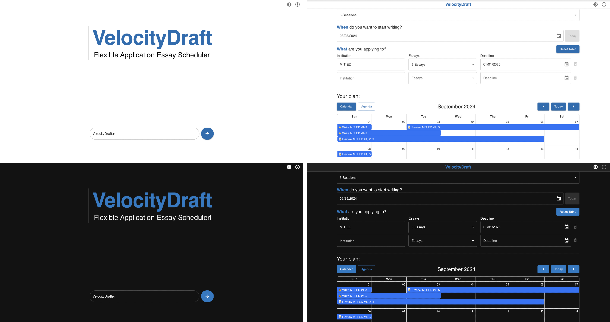

# VelocityDraft

## App Info

Flexible application essay scheduler, access application [here](shuklabhay.github.io/velocity-draft/).

Originally 3rd place submission at [2023 OneHacks III Hackathon,](https://devpost.com/software/velocitydraft) completely rewritten for 2024 Hack Club Arcade.
## Setup

- [Install](https://nodejs.org/en/download) Node.js 18 or higher
  - Confirm installation by running `node --version` in the command line
- [Install](https://docs.oracle.com/en/java/javase/20/install/overview-jdk-installation.html) Java JDK 11 or higher
  - Confirm installation by running `java --version` in the command line
- In the repo run `npm run setup`

## VSCode Setup

- Install [ESLint](https://marketplace.visualstudio.com/items?itemName=dbaeumer.vscode-eslint) and [Prettier](https://marketplace.visualstudio.com/items?itemName=esbenp.prettier-vscode) extensions
- In VSCode settings enable formatOnSave
- In VSCode settings select "Prettier - Code formatter" for the Default Formatter

## Development

- Run `npm run setup` to install dependencies
- Run `npm run dev` to start dev server
- Run `npm run lint` to format code and fix lint issues
